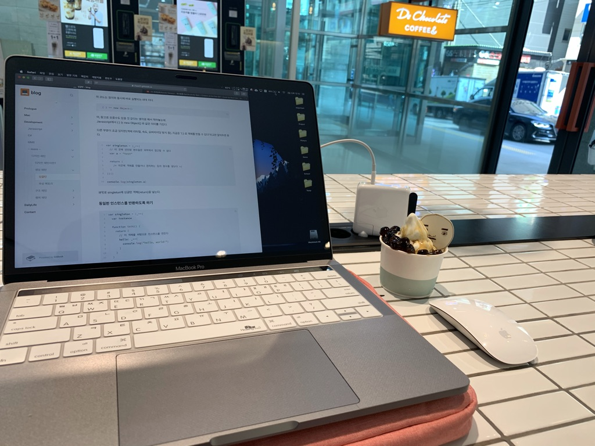

Hello My name is JeongHyeon Kim, I am a developer working at `GameSpring`

I'm Love `MicroService Architecture`, `FOSS`

### Career

| **Type** | **Date** | **Contents** | **Organization** |
|:--------:|:--------:|:--------:|:--------:|
| **🎓 Education** | 2017. 3 ~ 2020. 2 | Software Engineering | **Gwangju Software Meister High School** |
| **🧑‍💻 Work** | 2019. 11 ~ | Developing Online Game Server | **Gamespring** |

### Awards

| **Type** | **Date** | **What(Game Name)** | **Where** |
|:--------:|:--------:|:--------:|:--------:|
| **3rd** | 2016. 8 | 21KWC Content Development (LibertyLife) | **Woosong University** |
| **4th** | 2017. 8 | 21KWC Content Development (GRAVITY) | **Woosong University** |
| **3rd** | 2019. 4 | AppJam (The Life) | **SKT Plannet** |
| **3rd** | 2019. 12 | Indistars (Lactea) | **Gwangju Global Game Center** |

### Languages

### Tool

### Framework

### Cloud Service

### 📮 Contacts

